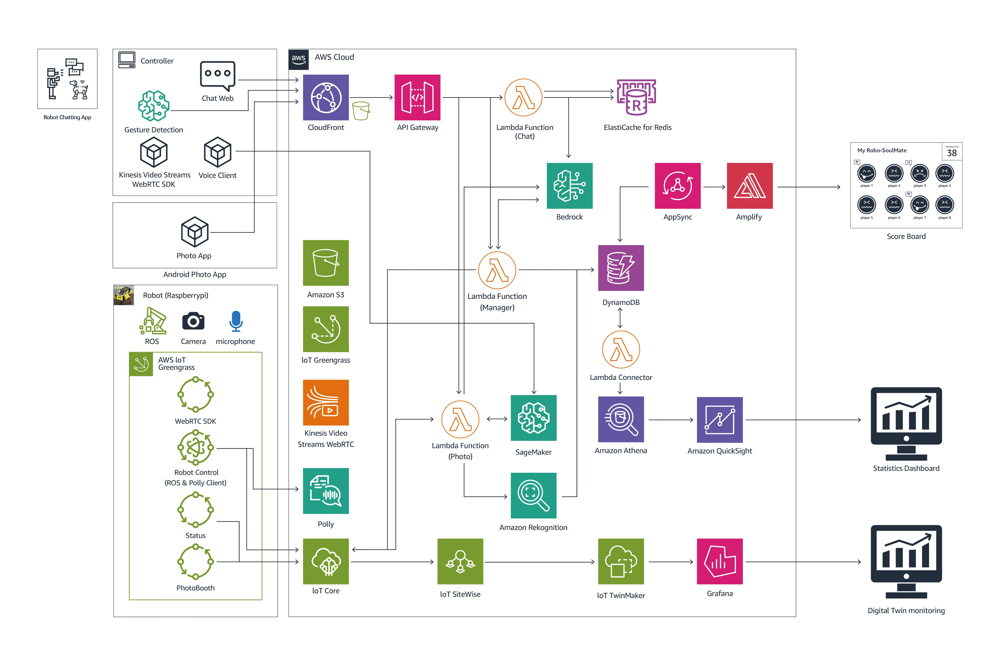

## Dancing Robot using Generative AI 

We show a demo of Generative AI using Robot where the project name of demo is Robo-SoulMate.

The overall architecture is as follows:

- The Voice Interpreter and IoT Controller are installed as components on AWS IoT Greengrass, and the AI Controller is configured as a JavaScript on the robot's Chrome browser.
- The visitor's voice is converted to text using the Voice Interpreter. The Voice Interpreter uses Amazon Transcribe to convert speech to text to minimize latency.
- The text is then delivered to the AI Controller via a pubsub method using CloudFront - API Gateway - Lambda (redis) - Amazon ElastiCache.
- Gestures are analyzed locally, and the results are delivered to the AI Controller.
- For image analysis other than gestures, the AI Controller captures images and interprets them using Bedrock's Claude3 (Sonnet) via CloudFront - API Gateway - Lambda (gesture).
- The visitor's voice is converted to text and displayed on the screen in a chatbot format, allowing the user to easily understand how the AI Robot operates.
- The converted text is processed using Bedrock's Claude3 (Haiku) via WebSocket through API Gateway - Lambda (chat). Prompt Engineering is used to handle various user intents.
- The final result is delivered to the user using Amazon Polly.
- The Dancing Robot performs various actions using the IoT Controller.
- User access and related metrics are collected through DynamoDB and displayed on QuickSight.
- IoT-related information can be viewed by visitors on a separate dashboard along with various IoT information using IoT SiteWise, etc.

  

These robots have personalities based on the 8 MBTI types and have names derived from AWS's representative services such as Lambda, SageMaker, and S3. 

It is a demo vodeo for SoulMate.

https://github.com/aws-samples/demo-dancing-robot-using-generative-ai/assets/52392004/1ab97cb8-67f9-4e30-ad5a-c39369be8ebb

### Controller

The operation of the Robot Controller according to the user's Reaction is described in [robot-controller.md](./robot-controller.md). 

### Photo Booth

In Photo Booth, Stable Diffusion images are generated. For more details, please refer to [photo-booth.md](./photo-booth.md). 

## Security

See [CONTRIBUTING](CONTRIBUTING.md#security-issue-notifications) for more information.

## License

This library is licensed under the MIT-0 License. See the LICENSE file.

