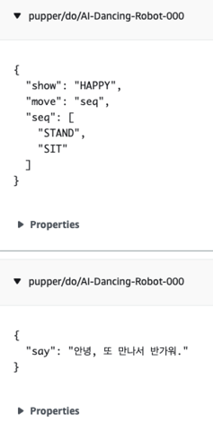

# Robot Controller

If the user receives a score between 1-5 based on the text they conversed with the robot using the Prompt, the robot will perform an action corresponding to that score. 

## Action description 

1) The client (JavaScript) sends a REST request through the '/control' API of the API Gateway. 
2) Lambda-control sends a message to IoT Core via MQTT. At this time, the thingName and client ID must use the same value. 
3) You can specify different actions by setting the message and action with the request type. 

## Controller infomation

The information passed to the controller is as follows: 

- user_id: User ID, same as thingName. e.g. AI-Dancing-Robot-000. ex) AI-Dancing-Robot-000
- request_id: for logging
- type: “text” or “action
- message: Message delivered when type is "text" 
- score: When the type is "action", the score passed 

Using the scores, the actions are defined by referring to the [relevant code](./lambda-controller/lambda_function.py). If the definitions for show, move, and seq are provided based on the scores below, I will update them. 

```python
score = event['score']
        print('score: ', score)
    
        if score == '5':
            show = 'HAPPY'
            move = 'seq'
            seq = ["MOVE_FORWARD", "SIT", "MOVE_BACKWARD"]
        elif score == '4':
            show = 'NEUTRAL'
            move = 'seq'
            seq = ["TURN_LEFT", "SIT", "TURN_RIGHT"]
        elif score == '3':
            #show = 'NEUTRAL'
            #move = 'seq'
            #seq = ["LOOK_LEFT","LOOK_RIGHT", "LOOK_LEFT"]
            isAction = False
        elif score == '2':
            show = 'SAD'
            move = 'seq'
            seq = ["MOVE_BACKWARD", "SIT", "MOVE_FORWARD"]
        elif score == '1':
            show = 'ANGRY'
            move = 'seq'
            seq = ["LOOK_LEFT","LOOK_RIGHT", "LOOK_LEFT", "LOOK_RIGHT"]
        else:
            show = 'NEUTRAL'
            move = 'seq'
            seq = ["LOOK_LEFT","LOOK_RIGHT", "LOOK_LEFT", "LOOK_RIGHT"]
        
        payload = json.dumps({
            "show": show,  
            "move": move, 
            "seq": seq
        })
```

The values delivered to Robo using MQTT are as follows:
- The message entered by the user is played back on the Robot using Polly.
- Depending on the reaction score, the Robot performs the following actions: 
   

